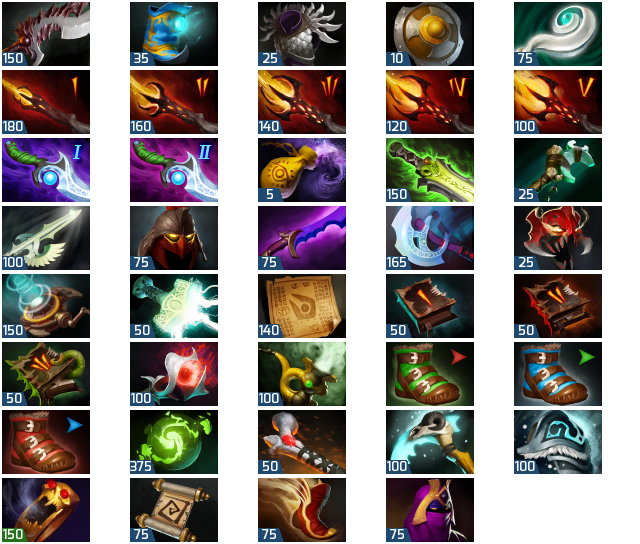

# Dota 2 Mod - Mana cost for items

This mod adds mana/health cost to the icons of in-game items.
There are additional modification to upgradeable items and Power threads, indicating their level or the next stat.

The prerendered image modifications were made by Reddit user **/u/lerobotsexy**, who also originally came up with the idea for this mod.

The repo contains a bunch of scripts to automatically generate the images based on data included with the game.
This way the icon set can quickly be regenrated in the case of a game patch.

## Installation

1. Download the latest `release.zip` from the [release section](https://github.com/rossengeorgiev/dota2mod_manacost/releases)
2. Extract in `[steam folder]\steamapps\common\dota 2 beta\dota\resource\flash3\images`
3. Add `-override_vpk` to Dota 2 launch options

## Building

### Required tools
* HLExtract `Windows x86/x64` `Included`
* Python w/ Imaging library
* `optional` bash
* `optional` zip

### Steps
1. Make sure the correct path is set in `fetch_src_files.bat`
2. Run `fetch_src_files.bat`. Fetches all item images and the items.txt schema to `./src/`
3. Run `render_icons.py`. Renders the new images with their health/mana cost to `./items/`
4. `optional` Create a release zip file with `build_release.sh`

