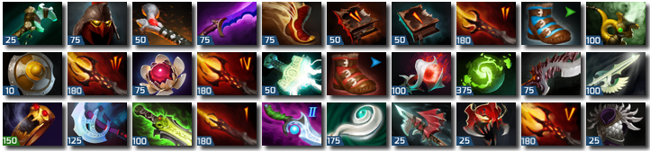
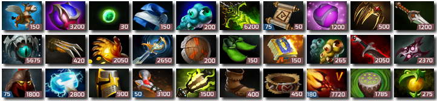
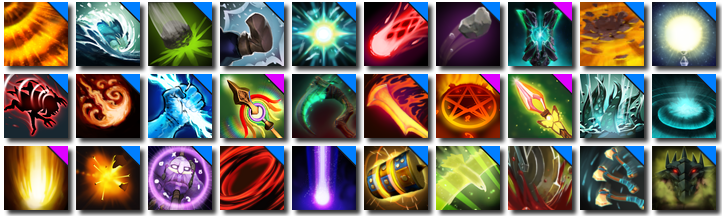

### Dota 2 mod — Mana cost for items
----
[▶ Download latest version](https://github.com/rossengeorgiev/dota2mod_manacost/releases)
&nbsp;&nbsp;&nbsp;&nbsp;&nbsp;&nbsp;
[▶ Issues & suggestions](https://github.com/rossengeorgiev/dota2mod_manacost/issues)

----

This mod adds mana/health cost to the icons of in-game items.
There are additional modification to upgradeable items and Power threads, indicating their level or the next stat.

The prerendered image modifications were made by Reddit user **/u/lerobotsexy**, who also originally came up with the idea for this mod.

#### Item gold cost variant

Adds item gold cost. Useful for quickly estimating networth of enemy heroes. Below is a preview of the combined version.

#### Ability damage type mod

Color codes the ability damage type in the top right corner. Physical/Magic/Pure are respectively Red/Blue/Purple.

----

The repo contains a bunch of scripts to automatically generate the images based on data included with the game.
This way the icon set can quickly be regenerated in the case of a game patch.

## Installation

1. Download the latest `mod_xxxxxxxx.zip` from the [release section](https://github.com/rossengeorgiev/dota2mod_manacost/releases)
2. Extract in `[steam folder]\steamapps\common\dota 2 beta\game\dota_addons`
3. Add `-enable_addons -addon client_mods` to Dota 2 launch options

## Building

### Required tools
* Python & pip
* `optional` zip
* `optional` ImageMagik

### Steps
1. `pip install -r requirements.txt`
2. Set `vpk_path` in `render_icons.py`
3. `python render_icons.py`. Renders all images to `./out/`
4. `optional` `build_release.sh` Create zip file releases

